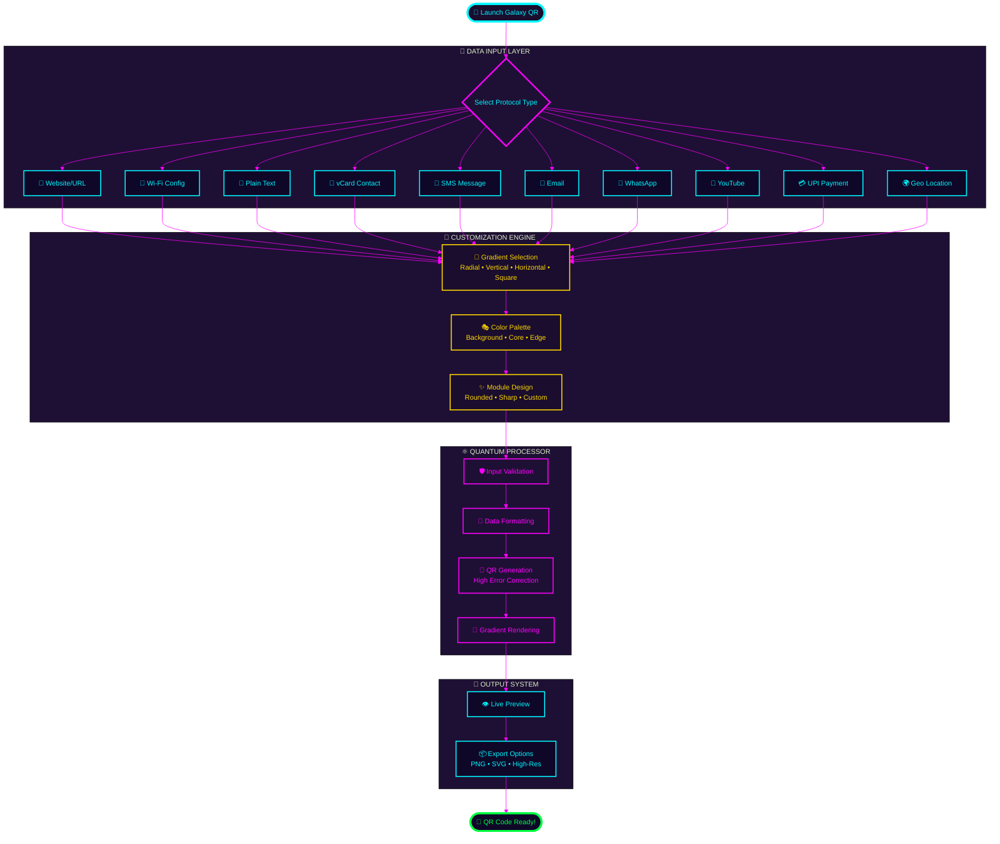
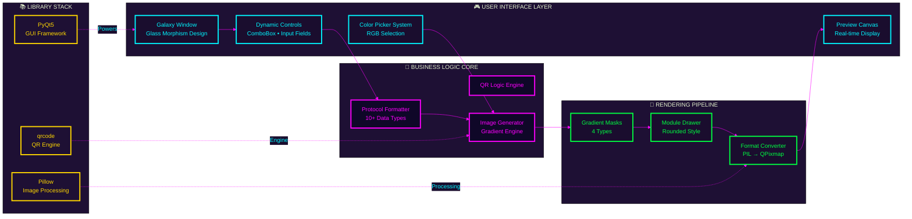

<div align="center">

# 🌌 GALAXY QR CORE 🌌


### ✨ *Cinematic Gradient QR Codes with Space-Age Technology* ✨

[](https://python.org)
[](https://pypi.org/project/PyQt5/)
[](LICENSE)
[]()

[🚀 Quick Start](#-quick-start) • [✨ Features](#-features) • [📖 Docs](#-documentation) • [🤝 Contribute](#-contribute)


</div>

---

<div align="center">


</div>

## 🎬 Application Workflow

<div align="center">


</div>



<div align="center">


</div>

---

<div align="center">


</div>

## 🏗️ System Architecture

<div align="center">


</div>



<div align="center">


</div>

---

<div align="center">


</div>

## ✨ Features

<div align="center">


</div>

<table>
<tr>
<td width="50%" valign="top">

### 🎨 Visual Excellence

- 🌌 Space-themed Galaxy UI
- 💎 Glass morphism effects
- ✨ Glowing neon buttons
- 🌠 Smooth animations
- 🎭 Custom color palettes
- 🖼️ Real-time preview
- 🌈 Dynamic gradients
- ⚡ Responsive design

</td>
<td width="50%" valign="top">

### 🔒 Privacy First

- 🛡️ 100% Offline operation
- 🔐 No cloud uploads
- 💻 Local processing only
- 🚫 No telemetry
- 🌐 No analytics
- 👤 Private by design
- 📊 No data collection
- ✅ GDPR compliant

</td>
</tr>
<tr>
<td width="50%" valign="top">

### 🎭 Gradient Magic

- 🌈 Radial gradient
- 📊 Vertical gradient
- ↔️ Horizontal gradient
- ⬜ Square gradient
- 🎨 Custom RGB colors
- 🖌️ 3-point color mixing
- 👁️ Live preview
- 🌟 High contrast modes

</td>
<td width="50%" valign="top">

### ⚡ Smart Generation

- 💫 High error correction
- ⭕ Rounded modules
- 🔄 Auto-format protocols
- ⚡ Instant generation
- 📝 Dynamic input fields
- ✅ Input validation
- 🛡️ Crash prevention
- 🔍 Empty check safety

</td>
</tr>
</table>

<div align="center">


</div>

---

<div align="center">


</div>

## 📡 Supported Protocols

<div align="center">


```
╔══════════════════════════════════════════════════════════════════════╗
║                     10+ PROTOCOL SUPPORT MATRIX                      ║
╚══════════════════════════════════════════════════════════════════════╝
```

| Icon | Protocol | Format | Use Case |
|:----:|:---------|:-------|:---------|
| 🔗 | **Website/URL** | Standard URL | Direct web links |
| 📶 | **Wi-Fi Config** | `WIFI:S:SSID;T:WPA;P:password;;` | Network sharing |
| 📝 | **Plain Text** | Any text | General text data |
| 👤 | **vCard Contact** | VCF format | Business cards |
| 💬 | **SMS Message** | `SMSTO:phone:message` | Quick texting |
| 📧 | **Email** | `mailto:email@domain.com` | Email composition |
| 📱 | **WhatsApp** | `https://wa.me/number?text=msg` | WhatsApp chat |
| 🎥 | **YouTube** | Video URL | Video sharing |
| 💳 | **UPI Payment** | `upi://pay?pa=id@bank` | Indian payments |
| 🌍 | **Geo Location** | `geo:lat,long` | GPS coordinates |


</div>

---

<div align="center">


</div>

## 🚀 Quick Start

<div align="center">


</div>

### 📋 Prerequisites

```yaml
Python: 3.8 or higher (Recommended: 3.10+)
RAM: 2GB minimum
Storage: 50MB free space
OS: Windows | macOS | Linux
```

### 🔧 Installation Steps

```bash
# ═══════════════════════════════════════════════════════
# STEP 1: Clone the repository
# ═══════════════════════════════════════════════════════
git clone https://github.com/RajTewari01/QR_CODE_GENERATOR_WITH_EXE.git
cd QR_CODE_GENERATOR_WITH_EXE

# ═══════════════════════════════════════════════════════
# STEP 2: Install dependencies
# ═══════════════════════════════════════════════════════
pip install -r requirements.txt

# Or install manually
pip install PyQt5 qrcode[pil] pillow

# ═══════════════════════════════════════════════════════
# STEP 3: Launch application
# ═══════════════════════════════════════════════════════
python qr.py
```

### 🔨 Build Executable (Optional)

```bash
# Install PyInstaller
pip install pyinstaller

# Build standalone executable
pyinstaller --noconsole --onefile --name "GalaxyQR" qr.py

# Find the executable in dist/ folder
```

<div align="center">


</div>

---

<div align="center">


</div>

## 📖 Documentation

<div align="center">


</div>

### 🎯 How to Use

```
┌─────────────────────────────────────────────────────────────────┐
│  STEP 1 → Launch Application                                    │
│           Run: python qr.py                                      │
│                                                                   │
│  STEP 2 → Select Protocol                                       │
│           Choose from 10+ data types                             │
│                                                                   │
│  STEP 3 → Enter Data                                            │
│           Fill in dynamic fields                                 │
│                                                                   │
│  STEP 4 → Customize Appearance                                  │
│           ├─ Select gradient type                                │
│           ├─ Pick background color                               │
│           ├─ Pick core color                                     │
│           └─ Pick edge color                                     │
│                                                                   │
│  STEP 5 → Generate QR Code                                      │
│           Click "INITIALIZE GENERATION"                          │
│                                                                   │
│  STEP 6 → Export                                                │
│           Save as PNG or SVG                                     │
└─────────────────────────────────────────────────────────────────┘
```

### 🎨 Gradient Types Explained

```
┌──────────────────────────────────────────────────────────────┐
│  RADIAL       VERTICAL      HORIZONTAL      SQUARE           │
│                                                                │
│    ●●●          ████           ██████         ■■■■■■         │
│   ●  ●         ████           ██████         ■    ■         │
│  ●    ●        ████           ██████         ■    ■         │
│   ●  ●         ░░░░           ░░░░░░         ■    ■         │
│    ●●●          ░░░░           ░░░░░░         ■■■■■■         │
│                                                                │
│  Center→Edge  Top→Bottom    Left→Right    Center→Corners     │
└──────────────────────────────────────────────────────────────┘
```

### 📂 Project Structure

```
QR_CODE_GENERATOR_WITH_EXE/
├── qr.py                      # 🚀 Main application
├── RAJ_UltimateQR.exe         # 💫 Pre-built executable
├── requirements.txt           # 📦 Dependencies
├── README.md                  # 📖 Documentation
├── LICENSE                    # 📜 MIT License
├── generated_assets/          # 💾 Output folder
│   └── qrcode/
│       ├── QrCode_SVG1.png
│       ├── LOGO/
│       └── SVG/
└── logs/                      # 📋 Application logs
    └── module_logs/
        ├── Qr_Log.log
        └── Qr_svg_Log.log
```

<div align="center">


</div>

---

<div align="center">


</div>

## 🎓 Code Example

<div align="center">


</div>

```python
from qrcode import QRCode
from qrcode.image.styledpil import StyledPilImage
from qrcode.image.styles.colormasks import RadialGradiantColorMask
from qrcode.image.styles.moduledrawers import RoundedModuleDrawer
import qrcode.constants

# ═══════════════════════════════════════════════════════
# Initialize QR code with high error correction
# ═══════════════════════════════════════════════════════
qr = QRCode(error_correction=qrcode.constants.ERROR_CORRECT_H)
qr.add_data("https://github.com/RajTewari01")
qr.make(fit=True)

# ═══════════════════════════════════════════════════════
# Generate with gradient styling
# ═══════════════════════════════════════════════════════
img = qr.make_image(
    image_factory=StyledPilImage,
    module_drawer=RoundedModuleDrawer(),
    color_mask=RadialGradiantColorMask(
        back_color=(255, 255, 255),    # White background
        center_color=(0, 242, 96),      # Green center
        edge_color=(5, 117, 230)        # Blue edge
    )
)

# ═══════════════════════════════════════════════════════
# Save the QR code
# ═══════════════════════════════════════════════════════
img.save("galaxy_qr.png")
```

<div align="center">


</div>

---

<div align="center">


</div>

## 🤝 Contribute

<div align="center">


```
╔════════════════════════════════════════════════════════╗
║         JOIN THE GALAXY QR DEVELOPMENT TEAM!           ║
╚════════════════════════════════════════════════════════╝
```

</div>

### 🛠️ How to Contribute

```bash
# 1. Fork the repository
# 2. Clone your fork
git clone https://github.com/YOUR_USERNAME/QR_CODE_GENERATOR_WITH_EXE.git

# 3. Create a feature branch
git checkout -b feature/amazing-feature

# 4. Make your changes
# 5. Commit changes
git commit -m "✨ Add amazing feature"

# 6. Push to fork
git push origin feature/amazing-feature

# 7. Open Pull Request
```

### 💡 Contribution Areas

```
┌─────────────────────────────────────────────────────────┐
│  🐛 Bug Fixes              📱 Mobile Export Formats     │
│  ✨ New Gradient Styles    🎨 UI/UX Improvements        │
│  📖 Documentation          🌍 Internationalization      │
│  🧪 Test Coverage          🚀 Performance Optimization  │
└─────────────────────────────────────────────────────────┘
```

<div align="center">


</div>

---

<div align="center">


</div>

## 📜 License

<div align="center">


</div>

```
MIT License

Copyright (c) 2024 Biswadeep Tewari

Permission is hereby granted, free of charge, to any person obtaining a copy
of this software and associated documentation files (the "Software"), to deal
in the Software without restriction, including without limitation the rights
to use, copy, modify, merge, publish, distribute, sublicense, and/or sell
copies of the Software, and to permit persons to whom the Software is
furnished to do so, subject to the following conditions:

The above copyright notice and this permission notice shall be included in all
copies or substantial portions of the Software.

THE SOFTWARE IS PROVIDED "AS IS", WITHOUT WARRANTY OF ANY KIND, EXPRESS OR
IMPLIED, INCLUDING BUT NOT LIMITED TO THE WARRANTIES OF MERCHANTABILITY,
FITNESS FOR A PARTICULAR PURPOSE AND NONINFRINGEMENT. IN NO EVENT SHALL THE
AUTHORS OR COPYRIGHT HOLDERS BE LIABLE FOR ANY CLAIM, DAMAGES OR OTHER
LIABILITY, WHETHER IN AN ACTION OF CONTRACT, TORT OR OTHERWISE, ARISING FROM,
OUT OF OR IN CONNECTION WITH THE SOFTWARE OR THE USE OR OTHER DEALINGS IN THE
SOFTWARE.
```

---

<div align="center">


</div>

## 👨‍💻 Author

<div align="center">


<br><br>

[](https://github.com/RajTewari01)
[](mailto:tewari765@gmail.com)
[](https://instagram.com/light_up_my_world01)

<br>


### ⭐ Star this repository if you find it helpful!

**Made with 💜 and ☕ by Biswadeep Tewari**

<br>


</div>
