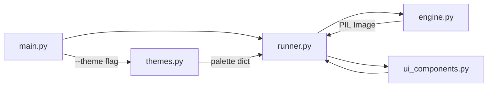
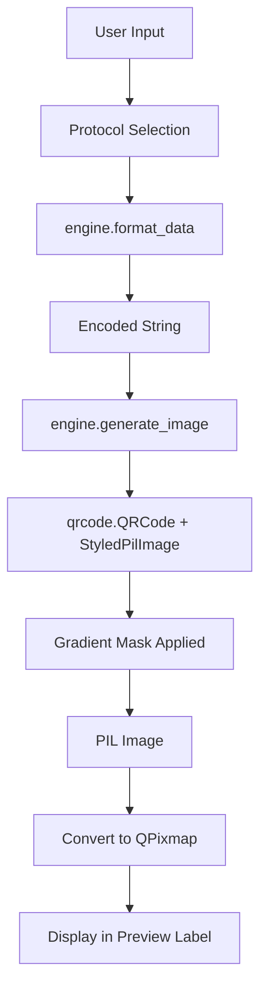
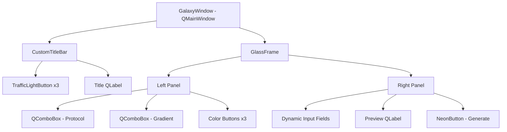

<div align="center">

# Galaxy QR Core

**A desktop QR code generator built with PyQt5, supporting 10 data protocols, 4 gradient types, and 10 switchable UI themes.**

[](https://python.org)
[](https://pypi.org/project/PyQt5/)
[](LICENSE)
[](.github/workflows/build.yml)

</div>

---

## What It Does

Galaxy QR Core generates styled QR codes with gradient color masks and rounded modules. It runs entirely offline—no network calls, no telemetry, no cloud dependencies.

**Supported data types:** URL, Wi-Fi, Plain Text, vCard, SMS, Email, WhatsApp, YouTube, UPI, Geo Coordinates.

**Gradient options:** Radial, Vertical, Horizontal, Square — each with configurable background, core, and edge colors.

---

## Architecture

The codebase follows a strict layered pipeline. Each concern lives in its own module under `src/`.

```
src/
├── main.py            # Entrypoint. Parses CLI args, boots QApplication.
├── themes.py          # Theme registry. 10 color palettes as dicts.
├── engine.py          # QR logic. Protocol formatting + image generation.
├── ui_components.py   # Reusable widgets: title bar, glass frame, buttons.
└── runner.py          # Main window. Wires engine ↔ UI ↔ themes.
```


```mermaid
graph LR
    A[main.py] -->|--theme flag| B[themes.py]
    A --> C[runner.py]
    C --> D[engine.py]
    C --> E[ui_components.py]
    E --> C
    D -->|PIL Image| C
    B -->|palette dict| C
```

### Data Flow


```mermaid
graph TD
    A[User Input] --> B[Protocol Selection]
    B --> C[engine.format_data]
    C --> D[Encoded String]
    D --> E[engine.generate_image]
    E --> F[qrcode.QRCode + StyledPilImage]
    F --> G[Gradient Mask Applied]
    G --> H[PIL Image]
    H --> I[Convert to QPixmap]
    I --> J[Display in Preview Label]
```

### UI Component Tree


```mermaid
graph TD
    MW[GalaxyWindow - QMainWindow] --> TB[CustomTitleBar]
    MW --> GF[GlassFrame]
    TB --> TC[TrafficLightButton x3]
    TB --> TL[Title QLabel]
    GF --> LP[Left Panel]
    GF --> RP[Right Panel]
    LP --> CM[QComboBox - Protocol]
    LP --> CG[QComboBox - Gradient]
    LP --> CB[Color Buttons x3]
    RP --> IL[Dynamic Input Fields]
    RP --> PV[Preview QLabel]
    RP --> GB[NeonButton - Generate]
```

---

## Themes

10 built-in themes selectable via `--theme` flag:

| Theme | Background | Accent | Best For |
|:------|:-----------|:-------|:---------|
| `apple-dark` | `#121219` | Green→Blue gradient | Default, clean |
| `dracula` | `#282a36` | `#bd93f9` | Purple lovers |
| `neon-cyber` | `#000000` | Magenta→Cyan gradient | High contrast |
| `solarized` | `#002b36` | `#268bd2` | Easy on eyes |
| `ocean` | `#0f172a` | `#0ea5e9` | Cool tones |
| `matrix` | `#0d0208` | `#00ff41` | Terminal aesthetic |
| `synthwave` | `#2b213a` | Pink→Orange gradient | Retro vibes |
| `monokai` | `#272822` | `#f92672` | Code editor fans |
| `nord` | `#2e3440` | `#88c0d0` | Scandinavian minimal |
| `crimson` | `#110000` | `#cc0000` | Dark red |

---

## Setup

### Prerequisites

- Python 3.10 or higher
- `pip` package manager
- Git

---

### Windows

```powershell
git clone https://github.com/RajTewari01/QR_CODE_GENERATOR_WITH_EXE.git
cd QR_CODE_GENERATOR_WITH_EXE

python -m venv venv
venv\Scripts\activate

pip install -r requirements.txt

python src/main.py
python src/main.py --theme dracula
```

### macOS

```bash
git clone https://github.com/RajTewari01/QR_CODE_GENERATOR_WITH_EXE.git
cd QR_CODE_GENERATOR_WITH_EXE

python3 -m venv venv
source venv/bin/activate

pip install -r requirements.txt

python src/main.py
python src/main.py --theme synthwave
```

### Linux (Debian/Ubuntu)

```bash
git clone https://github.com/RajTewari01/QR_CODE_GENERATOR_WITH_EXE.git
cd QR_CODE_GENERATOR_WITH_EXE

sudo apt-get install -y python3-venv python3-pyqt5 libgl1-mesa-glx

python3 -m venv venv
source venv/bin/activate

pip install -r requirements.txt

python src/main.py
python src/main.py --theme matrix
```

---

## Building Executables

### Windows

```powershell
venv\Scripts\activate
pip install pyinstaller
pyinstaller UltimateQR.spec
# Output: dist\GalaxyQR.exe
```

### macOS

```bash
source venv/bin/activate
pip install pyinstaller
pyinstaller UltimateQR.spec
# Output: dist/GalaxyQR.app
```

### Linux

```bash
source venv/bin/activate
pip install pyinstaller
pyinstaller UltimateQR.spec
# Output: dist/GalaxyQR
```

The GitHub Actions workflow (`.github/workflows/build.yml`) runs this automatically on push for all three platforms. Artifacts are uploaded and retained for 7 days.

---

## CLI Reference

```
usage: main.py [-h] [--theme THEME]

Galaxy QR Core Engine

options:
  -h, --help     show this help message and exit
  --theme THEME  UI theme (default: apple-dark)

Available themes:
  apple-dark, dracula, neon-cyber, solarized, ocean,
  matrix, synthwave, monokai, nord, crimson
```

---

## Project Structure

```
QR_CODE_GENERATOR_WITH_EXE/
├── src/
│   ├── main.py              # CLI entrypoint
│   ├── themes.py            # Theme palette definitions
│   ├── engine.py            # QR generation logic + protocol formatter
│   ├── ui_components.py     # Title bar, glass frame, buttons
│   └── runner.py            # Main application window
├── assets/                  # Project media files
├── .github/
│   └── workflows/
│       └── build.yml        # Cross-platform CI/CD pipeline
├── requirements.txt         # Python dependencies
├── UltimateQR.spec          # PyInstaller build specification
├── LICENSE                  # MIT License
├── .gitignore               # Git exclusion rules
└── README.md                # This file
```

---

## Dependencies

| Package | Purpose |
|:--------|:--------|
| `PyQt5` | GUI framework |
| `qrcode[pil]` | QR code generation with styled image support |
| `Pillow` | Image processing and format conversion |
| `pyinstaller` | Executable packaging (build-time only) |

---

## Contributing

1. Fork this repository
2. Create a feature branch: `git checkout -b feature/your-feature`
3. Commit: `git commit -m "Add your feature"`
4. Push: `git push origin feature/your-feature`
5. Open a Pull Request

Please follow the existing code structure. New features should be added to the appropriate pipeline module, not crammed into a single file.

---

## License

MIT License — see [LICENSE](LICENSE) for full text.

---

<div align="center">

**Biswadeep Tewari** · [GitHub](https://github.com/RajTewari01) · [tewari765@gmail.com](mailto:tewari765@gmail.com)

</div>
